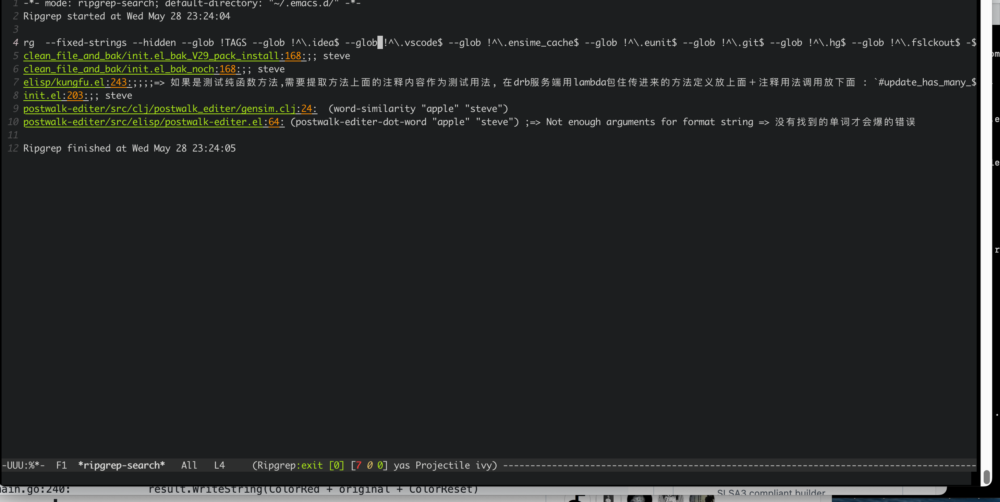
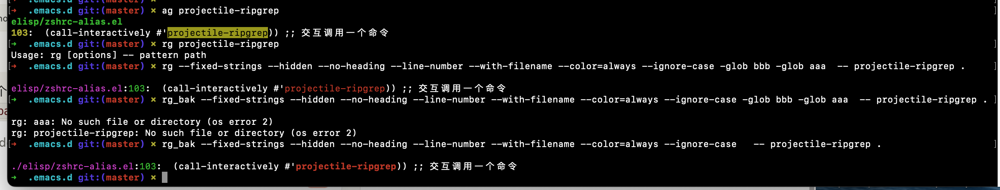

## ripgrep write by go

```
$ go build -o rg main.go

go-ripgrep git:(main) ✗ ./rg --fixed-strings --hidden --no-heading --line-number --with-filename --color=always --ignore-case -- Color .

main.go:14:	ColorReset  = "\033[0m"
main.go:15:	ColorRed    = "\033[31m"
main.go:16:	ColorGreen  = "\033[32m"
main.go:17:	ColorYellow = "\033[33m"
main.go:18:	ColorBlue   = "\033[34m"
main.go:19:	ColorPurple = "\033[35m"
main.go:20:	ColorCyan   = "\033[36m"
main.go:21:	ColorWhite  = "\033[37m"
main.go:30:	color        bool
main.go:48:	// 自定义color参数处理
main.go:49:	colorFlag := flag.String("color", "never", "When to use colors (never, always, auto)")
main.go:53:	// 处理color参数
main.go:54:	config.color = *colorFlag == "always" || (*colorFlag == "auto" && isTerminal())
main.go:163:		if config.color {
main.go:164:			parts = append(parts, ColorPurple+filename+ColorReset)
main.go:172:		if config.color {
main.go:173:			parts = append(parts, ColorGreen+fmt.Sprintf("%d", lineNum)+ColorReset)
main.go:181:	if config.color {
main.go:204:	return strings.ReplaceAll(line, pattern, ColorRed+pattern+ColorReset)
main.go:240:		result.WriteString(ColorRed + original + ColorReset)
...

```

## Use in Emacs ripgrep



## Diff rg , ag , rg by rust



